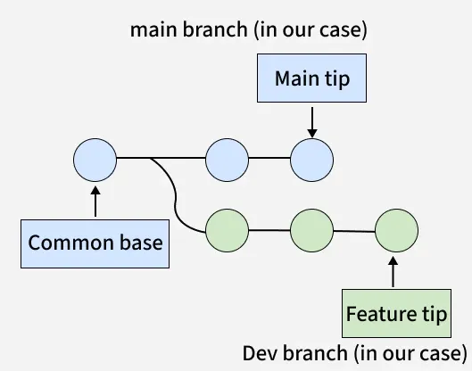
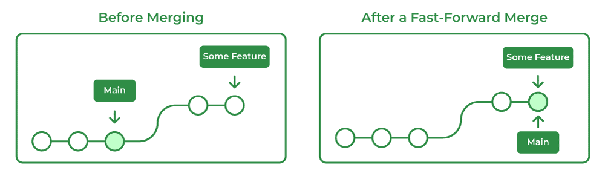
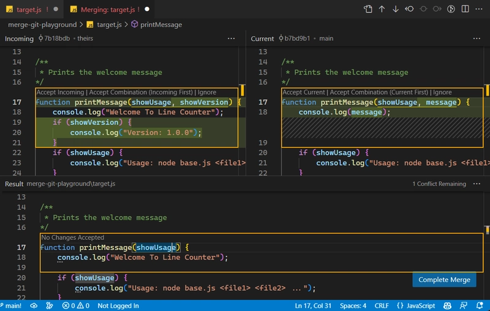

# Apuntes de Git y GitHub

## Lenguaje de Markdown

Antes de empezar, el markdown es un
lenguaje de marcaje ligero
que utiliza caracteres de puntuación simples
(asteriscos, almohadillas, guiones) para dar
formato al texto plano, siendo fácil de leer
y convirtiéndose fácilmente a HTML, PDF o DOCX.
Es ampliamente utilizado para documentación técnica, repositorios Git, notas y blogs.

## Lista de los elementos basicos del md

### Headings

# Heading level 1

## Heading level 2

### Heading level 3

#### Heading level 4

##### Heading level 5

###### Heading level 6

---

### Texto bold (negritas)

I just love **bold text**.
Love**is**bold

---

### Texto italico

Italicized text is the _cat's meow_.
A _cat_ meow.

---

### Texto en negrita y cursiva

This text is **_really important_**.
This is really***very***important text.

---

### Citas en bloque

> Dorothy followed her through many of the beautiful rooms in her castle.
>
> > The Witch bade her clean the pots and kettles and sweep the floor and keep the fire fed with wood.

---

### Listas desordenadas

- First item
- Second item
- Third item
- Fourth item

---

### Texto como codigo

At the command prompt, type `nano`.

---

### Bloques de codigo

```java
System.out.println("Hola Mundo");
```

---

### URLs

<https://www.markdownguide.org>
<fake@example.com>

---

### Formato de enlaces

I love supporting the **[EFF](https://eff.org)**.
This is the _[Markdown Guide](https://www.markdownguide.org)_.
See the section on [`code`](#code).

---

### Imagenes


---

---

## Inicio a Git

### Pasos para iniciar

El primer paso que vamos a necestiar para
empezar a usar Git. Es un usuario y un email,
para ello el comando fundamental para configurar cualquier
cosa de git es:

- `git config --global user.name "tuUsuario"`

este comando abre la configuracion de git de forma global,
es decir, para todos los usuarios del equipo en uso y crea un usuario "tuUsuario".

- `git config --global user.email "tuUsuario@email"`

Este comando es para agregar el email de tu usuario.

Ya con esto, para inicializar un repositorio git en un directorio que nosotros queramos, nos ubicamos dentro del directorio y ahí podemos usar el comando:

- `git init`

Con esto iniciamos git en ese directorio en un branch llamado "master".

---

### Manejo de Básico de Repositorio

Por el momento empezaremos a trabajar en una rama llamada master, que es la
copia definitiva de el proyecto.

Para poder empezar a subir cambios de nuestros archivos, tenemos que entender
primero que todo lo que modifiquemos o que creamos, está trabajándose localmente,
es decir, no afectará al repositorio, en cambio si queremos guardar cambios de los
archivos, tenemos que poner estos archivos en algo llamado "staging area".

Este básicamente es un área intermedia entre tu directorio de trabajo y el
repositorio donde preparas los cambios para que se hagan efectivos con un commit.
Para poner archivos en esta area, se usa el comando:

- `git add tuarchivo.ext`

Con esto, ahora el archivo está en el staging area.

Para manejar mejor estas adiciones, se usa el comando:

- `git status`

Que lo que hace es mostrar el estado actual de tu repositorio, detallando qué archivos han sido modificados, cuáles están preparados para el siguiente commit (staging area) y cuáles no están siendo rastreados.

Si ya estamos listos para que estos cambios sean efectuados, podemos hacer un commit
y con esto actualizar la "versión" o "copia" de nuestro proyecto en nuestra
rama master, esto con el siguiente comando:

- `git commit -m "Un mensaje obligatorio para tu commit"`

Y con esto ya tenemos nuestra primer versión de nuestro proyecto en nuestro
repositorio, cabe recalcar que cada versión que subamos tendrá un identificador
único.

Para ver el historial de los commits junto con la información de los mismos
podemos usar el comando:

- `git log`

Este comando fundamental de Git es utilizado para visualizar el historial de confirmaciones (commits) de un repositorio, mostrando cronológicamente (del más reciente al más antiguo) el identificador (hash SHA), autor, fecha y mensaje de cada cambio.

El problema con este comando, es que solo muestra el historial de commits, pero si lo que nosotros queremos hacer es ver todo el historial de los cambios que se han hecho, podemos usar este otro comando.

- `git reflog`

Pasanso a otro caso, si tenemos modificado un archivo pero queremos devolerlo a como estaba en
el último commit realizado, podemos usar el comando:

- `git restore tuarchivo`

El cual descarta cambios que no se pusieron en el área de staging.

En cambio si lo que buscamos es deshacer todos los cambios locales
del repositorio, usamos el comando

- `git reset`

El cual mueve el puntero de la rama (HEAD) a una confirmación (commit) anterior y ajustando el área de preparación (staging area) y el directorio de trabajo según el modo utilizado (--soft, --mixed, --hard). Actúa como una máquina del tiempo para reescribir la historia localmente, siendo la opción --hard la más drástica al eliminar cambios no confirmados.

Principales modos de git reset:

- soft: Mueve el HEAD al commit especificado, pero mantiene tus cambios actuales en el área de preparación (listos para un nuevo commit).
- mixed (predeterminado): Mueve el HEAD y restablece el área de preparación al commit indicado, pero mantiene los cambios en el directorio de trabajo como archivos no modificados (unstaged).
- hard: Mueve el HEAD, restablece el área de preparación y el directorio de trabajo al commit especificado. Borra todos los cambios no confirmados, por lo que es una operación destructiva.

Es importante también mencionar que el `git reset --hard <commit>` sirve tanto para ir hacia el pasado, como para volver hacia adelante, por ejemplo, si nosotros por accidente borramos un commit que no queríamos perder, podemos con el comando `git reflog` ver nuestro historial de cambios, ver el HASH ID del commit que queremos recuperar, y volver hacia el usando otro: `git reset --hard <commit>`, y con esto, ya estaremos devuelta en el commit.

### Alias

Pasando a otro punto si no queremos memorizar tantos comandos y queremos de alguna forma crear atajos
para estos comandos, podemos usar lo que es un "alias", podemos usarlo, por ejemplo por si queremos crear un atajo para el siguiente comando para que nos muestre un log mas ordenado:

- `git log --graph --decorate --all --oneline`

Si no queremos memorizar todo eso, le podemos agregar un alias de la siguiente manera:

- `git config --global alias.mialias "--graph --decorate --all --oneline"`

Con este comando estamos creando un alias global llamado "mialias" con el que se ejecutará lo que está adentro de las comillas, así que la próxima vez que se necesite usar ese comando largo, ahora solo usamos nuestro alias:

- `git mialias`

Y se ejecutará nuesto comando.

### Archivo .gitignore

Pasando a otro caso, imaginemos que tenemos archivos o directorios en nuestro repositorio que realmente no ocupamos subir con un commit, el problema va a ser, que git por defecto te estará recordando siempre de subir el archivo. Para evitar esto, lo que se usa es un archivo oculto en tu directorio en el que podrás meter todos los archivos o directorios que quieras que git ignore, ya que no les quieres crear una copia, para crear este archivo en tu repositorio vamos a usar:

- `touch .gitignore`

Ya con esto tendremos un archivo en el que dentro podremos excluir archivos del rastreo de git, algunos ejemplos de lo que podemos escribir dentro son:

> Dependencias
>
> > node_modules/
>
> Archivos de entorno (Contraseñas/API Keys)
>
> > .env
> > .env.local
>
> Build artifacts
>
> > dist/
> > build/
>
> Logs
>
> > npm-debug.log*
> > yarn-error.log*

### Git diff

Este nuevo comando nos servirá a la hora de querer comparar distintos estados estados de nuestro repositorio por ejemplo, si hemos modificado un archivo y queremos ver qué partes han sido añadidas, eliminadas o modificadas, usamos git diff, comando el cual desplegará una lista de cambios que se han realizado en tu directorio que no se han puesto todavía en el área de staging. Algunso otros ejemplos de uso del git diff son:

- `git diff --staged` : Muestra cambios que han sido añadidos al stage pero que aún no han sido comiteados.

- `git diff <commit>` : Muestra todos los cambios locales añadidos o no relativos a un commit o branch específico.

- `git diff <commit1> <commit2>` : Muestra los cambios entre dos commits que tu elijas.

### Desplazamiento por una Rama

En este momento lo que sabemos es que cuando trabajamos, existe una rama principal que se llama main que es donde estamos, esta tiene varios commits o sea varias versiones de tu directorio local, pero cómo sabemos en qué parte del tiempo estamos parados? Para esto debemos comprender lo que es el `HEAD`, el HEAD es un puntero simbólico que indica donde estas parado actualmente en tu historial, por lo que por lo general está apuntando a la rama en la que estás parado.

Ahora, si nosotros queremos "regresar al pasado", tenemos que mover nuestro HEAD, esto lo podemos lograr con el comando:

- `git checkout`

Este comando es el que te permite mover tu HEAD (poniendote en un estado detached HEAD ya que en lugar de apuntar a la rama, apuntas a un commit) a determinado commit que elijas y con esto, cambiar los archivos de tu directorio a como los tenías en ese momento exacto del tiempo, para indicar a qué commit quieres viajar, tenemos que ingresar el Hash ID de dicho commit, un ejemplo de esto puede ser:

- `git commit asdf893480d0adkpty`

Y para volver al presente (volver a la punta de nuestra rama actual) simplemente hacemos un checkout al nombre de la rama:

- `git checkout main`

Y con esto ya estaremos devuelta al presente!

### Git tag

`git tag` es un comando que nos permite marcar un commit específico al que queramos tener identificado, esto lo hace poniéndole una etiqueta que nosotros queramos, por ejemplo, si lanzamos una versión de nuestro proyecto importante que queremos marcar, podemos usar:

- `git tag version2_proyecto`

Ya con esto tendremos marcado ese punto del tiempo por si queremos volver a el usando un:

`git checkout version2_proyecto`

Para listar todos los tags que tenemos, simplemente se usa:

`git tag`

---

## Branches

Las ramas (branches) en Git son punteros ligeros y móviles hacia los commits,permitiendo crear entornos de trabajo aislados, paralelos y seguros, sin afectar la rama principal (main/master). Facilitan el desarrollo de nuevas funcionalidades, pruebas o correcciones, permitiendo fusionar cambios posteriormente.

Una vez entendido este concepto de los branches, algunos de los comandos básicos para su manejo son los siguientes:

- `git branch`: Lista todas las ramas locales.
- `git branch <nombre>` : Crea una nueva rama.
- `git checkout <nombre>` : Salta a la rama indicada (en versiones modernas también se usa git switch).
- `git branch -d <nombre>` : Elimina una rama.

### Git merge

Ahora, qué pasa si queremos unir los cambios que hemos hecho en varios branches al main? Para esto usamos el `git merge`, el cual es un comando que se usa para integrar los cambios de una rama a otra. Este comando se ejecuta desde la rama que queremos que reciba los cambios, que por lo general es la main, una vez estés en tu rama, puedes ejecutar:

- `git merge rama_secundaria`

Y los cambios se agregarán a tu main!

Unos puntos a tener en cuenta sobre los **merge** son los siguiente:

- Preserva el historial completo de commits de ambos branches.
- Realiza merges automáticos a menos que existan conflictos que requieran de una solución manual.
- No elimina branches despues del merge.
- Comunmente usado para añadir características al main.

Para entender todo el proceso, usaremos una imagen de ejemplo:



En la imagen podremos observar elementos como lo son:

- Common Base: Es el commit de donde ambos branches se originaron, es su ancestro en común.
- Main tip: Es el útlimo commit realizado en el main branch.
- Feature tip: El último commit realizado en el dev branch.

Con esto en cuenta, lo que podemos observar es que cambios se han realizado en ambos branches y que estos vienen de un ancestro común que es el common base. Ahora veamos como se ve el repositorio después del merge:


Aquí lo que sucedió es que git comparó el main tip, el feature tip y el ancestro común y revisó los cambios que se realizaron y si no existe ningún conflicto para combinar ambos branches con un **merge commit**.

### Tipos de Merge

Una vez entendido el funcionamiento básico de git merge, pasaremos a los dos tipos que existen, que son el _fast-forward merging_ y el _Three way merging_.

**Fast-forward merging**: Este ocurre cuando mientras se hicieron cambios en el branch secundario, el main se mantuvo igual, así que lo que hace Git es que en lugar de hacer un merge commit, simplemente mueve el Main tip al Feature tip:



**Three way merging**: Este ocurre cuando han ocurrido cambios tanto en el branch secundario como en el main, Git lo que hace es generar un nuevo _merge commit_ comparando cambios que se realizaron y uniéndolos:


  
### Resolución de conflictos de Merge

Imaginemos que tenemos dos branches trabajando en un proyecto y cada uno de ellos hace sus commits, ahora imaginemos que ambos branches han modificado las mismas líneas de código, esto resultará en un problema a la hora de hacer el merge, ya que git directamente no elegirá por nosotros qué cambios son los que queremos mantener, así que entramos en el modo de resolución de conflictos, donde en nuestro editor podremos escoger y ver qué cambios queremos implementar y cuáles desechar. Esto en el editor se ve así:



Una vez resuelto el conflicto ya podemos realizar el merge sin ningún problema.

### Git stash

Git stash es un comando que nos permite guardar los cambios que hemos hecho en nuestro directorio en una pila interna y volvernos al estado del último commit. Esto es útil si por ejemplo realizamos cambios que no queremos commitear pero que queremos tener guardados, ya sea para:

- Hacer un switch de branches urgente, guardando tus cambios sin tener que commitearlos

- Para probar algo distinto sin ensuciar el historial de commits con versiones incompletas

- Hacer un `git pull` pero se tienen modificaciones locales que entran en conflicto.

Una lista de comandos esenciales para gestionar estos cambios son:

- `git stash`: Guarda tus cambios actuales y limpia el directorio de trabajo.
- `git stash list`: Muestra la lista de todos los "paquetes" de cambios que has guardado.
- `git stash pop`: Recupera los últimos cambios guardados, los aplica a tu rama actual y los elimina de la lista.
- `git stash apply`: Aplica los cambios pero los mantiene guardados en la lista (útil si quieres aplicarlos en varias ramas).
- `git stash drop`: Elimina un conjunto de cambios específico de la lista.
- `git stash clear`: Borra absolutamente todos los cambios que se tengan en la pila interna.

---

## Inicio a GitHub

Ahora ¿Cuál es la diferencia de Git y GitHub? ¿Son lo mismo? Bueno para entender esto, es útil ver sus roles por separado:

- Git (El Motor): Es un software de control de versiones que se instala localmente en la computadora. Funciona como una "máquina del tiempo" que registra cada cambio que se hace en tu código, permitiendo volver a versiones anteriores si algo falla.

- GitHub (El Almacén): Es un servicio de alojamiento en la web que utiliza Git como base. Permite subir repositorios locales a la nube para que otros puedan verlos, colaborar en ellos o simplemente para tener un respaldo seguro.

## Repositorio

Un repositorio en GitHub es la carpeta digital de tu proyecto que vive en internet. Es el lugar donde se almacena todo el código fuente, archivos, imágenes y, lo más importante, el historial completo de cambios de tu proyecto.

El repositorio puede ser tanto local, únicamente guardando los cambios con git en tu máquina, así como puede ser remoto, esto subiéndolo a la plataforma de GitHub.

Para crear un repositorio se puede tanto hace en tu cuenta de GitHub, o con la terminal dirigiéndote a la carpeta del proyecto y ejecutando el comando:

- `git init`

Y con esto tendremos nuestro "repo".

Otras cosas a tener en cuenta a la hora de crear un repo son las siguientes:

- Privacidad: Podemos escoger si queremos dejar la repo en público y que cualquier persona pueda ver el contenido, clonarlo y aprender de el. O podemos configurarlo como una repo privada para que solo tú y las personas con acceso puedan verlo.

- Archivo README: El README.md es como la carta de presentación del repo. Se escribe en lenguaje **Markdown**  y explica qué es el proyecto, cómo instalarlo y cómo usarlo.

- Add .gitignore: GitHub da la opción de crear el archivo .gitignore para el repo donde se podrán guardar cosas que no se quieren subir como archivos temporales o contraseñas.

- Add a license: Es algo más enfocado a grandes proyectos pero básicamente una licencia define cómo otros pueden usar, modificar o distribuir tu código.
